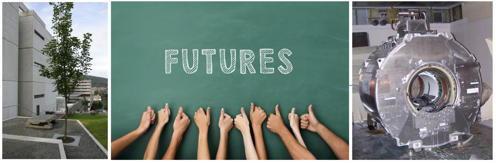
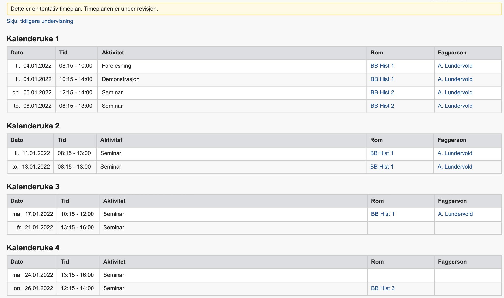

# ELMED219-2022: Artificial intelligence and computational medicine

The [course](https://www.uib.no/en/course/ELMED219) is offered by the [Department of Biomedicine](https://www.uib.no/biomedisin) in collaboration with the [Department of Computer science, Electrical engineering and Mathematical sciences](https://www.hvl.no/en/about/management/faculty-of-engineering-and-science/department-of-computer-science-electrical-engineering-and-mathematical-sciences-ny-side), Western Norway University of Applied Sciences, and the [Mohn Medical Imaging and Visualization Center](https://mmiv.no/).

  

During the course you will gain insight into computationally oriented thinking, machine learning and artificial intelligence, and an understanding of the pros and cons of AI for the future of medicine. The course provides a guided tour through some biomedical and clinical applications of mathematical and statistical modeling techniques, as well as principles for selected sensors and measuring instruments in research and clinical practice.

We meet concepts such as **big data**, **data analysis**, **machine learning**, and **artificial intelligence (AI)**, with examples from personalized and predictive medicine. You will use methods and tools from numerical programming, data analysis and "scientific computing" for medical applications, and learn about the importance of **open science**, **data sharing**, and **reproducible research**.

This repository contains most of the course material. Students enrolled in the course will also find some practical information at [MittUiB](https://mitt.uib.no/courses/33274).

For **academic questions** about the course, contact course coordinator [Arvid Lundervold](https://www.uib.no/en/persons/Arvid.Lundervold) (UiB) or [Alexander S. Lundervold](https://www.hvl.no/en/employee/?user=Alexander.Selvikvag.Lundervold) (HVL).

For **practical / administrative inquiries**, contact the Studies Section at the Department of Biomedicine at studie.biomed@uib.no

 The content for the course is offered with a <b><a href="http://creativecommons.org/licenses/by-sa/4.0">CC BY-SA 4.0</a></b> license unless otherwise stated.

--------

# Tentative time schedule, January 3-28, 2022

| **TIME**                    | ACTIVITY  <space> (NOTE: access to links will be provided in due time)                                                                                |
| --------------------------- | -------------------------------------------------------------------------------------------------------------------------------------------------------------------------------- |
| **Mon/Tue** **January 3-4** |                                                                                               |
| On your own                 | Get an overview of the course; installation of software and/or test out Google Colab                                                                                                                                                                                                                                                                       |
|                             | Follow the instructions at [MittUiB](https://mitt.uib.no/courses/33274/modules)                                                                                                                                                                                                                                                                  |
| **Tue, Jan 4**          |                                                                                                                                                                                        |
| 10:15-12:00    12.30-13.15    | About the course / Motivation lectures      [1-slides-about](https://docs.google.com/presentation/d/e/2PACX-1vQVoRtdQ_vez7Ob-e2zeX4BH3JtlHbYGmzrhhZoIOSUff34UkLfWs0S6o-9wBbIkOrWeym6Xb1fVOcC/pub?start=false&loop=false&delayms=3000), &nbsp; 1-PDF-slides-about, &nbsp; 1-video-about  [2-slides-CompMed](https://docs.google.com/presentation/d/e/2PACX-1vRzirGyqnp-y5XOs6CXOJshsRkA-qHfZNI--Ae-sBcxutF-Xewl0G6jcMBJDuETRwsjXOamTGUI025N/pub?start=false&loop=false&delayms=3000), &nbsp; 2-PDF-slides-CompMed, &nbsp; 2-video-CompMed   3-PDF-slides-medAI, &nbsp; 3-video-medAI   |
|                             | *Arvid Lundervold / Alexander Selvikvåg Lundervold*   |                                                                                                                                                                                                                                                                                                                          |
| **Wed, Jan 5**          |                                                                                                                                                                                                                                                                             |
| 10:15-12:00                 | Tools, teams and project work [1-slides-tools](https://docs.google.com/presentation/d/e/2PACX-1vSfh4yE3eQ8xweAQa31OOpDSuyre-O8Q5gkVuY7bupHYhK0ADZagV-2Oou6zvIxrxXCnmGy8C0T7r1K/pub?start=false&loop=false&delayms=3000),   1-video-tools [2-slides-team-project](https://docs.google.com/presentation/d/e/2PACX-1vTMORDbQCEEforuRHIcRQsioBC4ga57gPrw9efopd7nr5DSmgCbJI8fkM-pQkgG2xVudUTlVChtNHbT/pub?start=false&loop=false&delayms=3000),   [2-video-team-project]                                                                                                                                                                              |
|                             | *Arvid Lundervold / Alexander Selvikvåg Lundervold*                                                                                                                                                                                                                                                                                                       |
| **Thu, Jan 6**          |                                                                                                                                                                                                                                                                                                                                                   |
| 10:15-11:00                 | [LAB 0: Introduction to theory and tools for machine learning](./Lab0.1-ML)                                                                                                                                                                                                                                                                                                   |
|                             | *Alexander Selvikvåg Lundervold*                                                                                                                               |
| 11:15-12:00                 | Brain imaging (MRI) in glioblastoma [slides-brain-imaging](https://docs.google.com/presentation/d/e/2PACX-1vQNAH55zZASn_TkHBlapR_MzM47XE5dNReG_N6or1EKJeF2uKvrRL7FgEqpOrcsrEtPOZ7Q90UdOb-N/pub?start=false&loop=false&delayms=3000),   [video-brain-imaging]      [Lab 0.2-MRI (optional): Digital imaging and image analysis](./Lab0.2-MRI%20(optional)) focusing on MRI with a view to IMC                                                                                                                                                                                                                                                                                                                       |
|                             | *Arvid Lundervold*                                                                                                                                                                               |
|                             |                                                                                                                                                                             |
| **January 6 - January 11**  |                                                                                                                                                                              |
| On your own                 | You'll spend approximately four hours completing a DataCamp course (remember to use the link on MittUiB for free access to DataCamp). The rest of day you'll work on your course projects. Which DataCamp course you're encouraged to do depends on your previous programming experience:  - No Python programming experience? Complete the course [Introduction to Python](https://learn.datacamp.com/courses/intro-to-python-for-data-science) - Know some Python, but no machine learning? Can pass the *Python Programming Assessment* in our DataCamp group? Complete the course [Supervised Learning with scikit-learn](https://learn.datacamp.com/courses/supervised-learning-with-scikit-learn) - Know the fundamentals of machine learning in Python? Can pass the *Machine Learning Fundamentals Assessment*? Complete the course [Biomedical Image Analysis in Python](https://learn.datacamp.com/courses/biomedical-image-analysis-in-python) |
|                             |                                                                                                                                                                         |
| **Tue, Jan 11**         |                                                                                                                                                                                                                                                                |
| 10:15-11:00                 | [LAB 1: Medical health records and natural language processing](./Lab1-NLP)                                                                                                                             |
|                             | *Alexander Selvikvåg Lundervold*        
| 12:15-13:00                 | [LAB 2: The machine learning project lifecycle](./Lab2-MLeng)|
|                             | *Alexander Selvikvåg Lundervold*                                                                                                                                                                        |
|                             |                                                                                                                                                                       |
| **Thu, Jan 13**         |                                                                                                                                                                                                                                                                                                                                   |
| 10:15-12:00                 | [LAB 3: A quick introduction to deep learning](./Lab3-DL)|
|                             | *Alexander Selvikvåg Lundervold*                                                                                                                                                                                                                                                         |
|                             |                                                                                                                                                                                                                                                                   |
| **Mon, Jan 17**         |                                                                                                                                                                                                                                                                      |
| 10:15-11:00                 | [LAB 4: BRATS and multimodal MRI](./Lab4-BRATS) |
|                             | *Arvid Lundervold*                                                                                                                                                        |
|                             |                                                                                                                                                                            |
| **Fri, Jan 21**         |                                                                                                                                                                              |
| 10:15-12:00                 | Perspectives on medical AI: innovation, education, epistemology, ethics and impact <!--[slides-perspectives](https://hvl365-my.sharepoint.com/:p:/g/personal/allu_hvl_no/EWHgBpjjkZ9PnFHe36jSBSIBFRA9-FIEEnl2EjFRIYQwfQ?e=JpBrMI),   [video-perspectives](https://youtu.be/Gthd7acj8JA)         -->                                                                                                                                                             |
|                             | *Arvid Lundervold / Alexander Selvikvåg Lundervold*                                                                                                                                                                                                                        |
|                             |                                                                                                                                                                         |
| **Mon, Jan 24**         |                                                                                                                                                                                                                                                              |
| --- 17:00 ---               | [Team project](./project) report due                                                                                                                                                                                                                                  |
|                             |                                                                                                                                                                                                                                                                                                                                                              |
| **Wed, Jan 26**         |                                                                                                                                                                             |
| 10:15-12:00                 | Team project presentations (15 min)                                                    |
|                             |                                                                                                                                                                              |
| **Fri, Jan 28**         |                                                                                |
| 09:00-11:00                 | Digital home exam (using Inspera)                                                                                                                                                        |

<!-- <u>Tentative</u> time schedule
  
-->
<!--
______________________________________________________

# <u>Tentative</u> time schedule

| Time       |  Activity  <space> (NOTE: access to links will be provided in due time)  
|------------|-----------------------------------------------------------
|**Mon, January 4**|                                                  |               |
| On your own | Installation of software / Get an overview of the course |               |
|            | Follow the instructions at [MittUiB](https://mitt.uib.no/courses/27607/modules#module_27745)                                    |               |
|**Tue, January 5**|                                                  |               |
|10:15-12:00 | About the course / Motivation lectures       [1-slides-about](https://docs.google.com/presentation/d/e/2PACX-1vQozwdJ39W3DX2ju4CvCU1V1G6rLx8V6HC3SeUpeVrz3FnFd64mdPs0mc9-NjKG7lNVP_PX-9VB9zH8/pub?start=false&loop=false&delayms=3000), &nbsp; [1-video-about](https://youtu.be/O66FbWtn7f0)  [2-slides-CompMed](https://docs.google.com/presentation/d/e/2PACX-1vRzirGyqnp-y5XOs6CXOJshsRkA-qHfZNI--Ae-sBcxutF-Xewl0G6jcMBJDuETRwsjXOamTGUI025N/pub?start=false&loop=false&delayms=3000), &nbsp; [2-video-CompMed](https://youtu.be/6yyWwc8FmaI)   [3-video-medAI](https://youtu.be/_S-XMlDq32g)          
|            | *Arvid Lundervold / Alexander Selvikvåg Lundervold*       |               |
|**Wed, January 6**|                                                 |               |
|10:15-12:00 | Tools, teams and project work  [1-slides-tools](https://docs.google.com/presentation/d/e/2PACX-1vSfzcBXUBoZmBM51I_uM160fB0lRKg33O_omnyDSj_txf_AQ7vD9xElU-J_Z1DK4D16Jup8w545rXN-/pub?start=false&loop=false&delayms=3000), &nbsp; [1-video-tools](https://youtu.be/45JsopEXLuY)  [2-slides-team_project](https://docs.google.com/presentation/d/e/2PACX-1vRtDpikPzBJc6VD31FfbrDd1nOYntmfT0fPSrdczpNbo__odhqyGjNAhcFy7DPv4-ROTMnd2TOS3ORv/pub?start=false&loop=false&delayms=3000), &nbsp; [2-video-team_project](https://youtu.be/LWWVL8eEDOo)  | Join in Zoom  |
|            | *Arvid Lundervold / Alexander Selvikvåg Lundervold*       |               |
|**Thu, January 7**|                                               |               |
|10:15-11:00 | [LAB 0: Introduction to theory and tools for machine learning](https://github.com/MMIV-ML/ELMED219-2021/tree/main/Lab0-ML)     | Join in Zoom  |
|            | *Alexander Selvikvåg Lundervold*                          |               |
|11:15-12:00 | Brain imaging (MRI and IMC) in glioblastoma   [slides-brain_imaging](https://docs.google.com/presentation/d/e/2PACX-1vTW36Y-9DST39wHZZnwkDqfrVxlwDrXxAzBmiDgq1BLvf8I0NCGQ42SeOFJ7vXEEBvcJuxgBoAJaFJW/pub?start=false&loop=false&delayms=3000), &nbsp; [video-brain_imaging](https://youtu.be/DZMLqG28LPw)     |               |
|            | *Arvid Lundervold*                                        |               |
|            |                                                           |               |
|**Fri, January 8**|       |               |
| On your own | You'll spend approximately four hours completing a DataCamp course (remember to use the link on MittUiB for free access to DataCamp). The rest of day you'll work on your course projects. Which DataCamp course you're encouraged to do depends on your previous programming experience:  <ul><li>No Python programming experience? Complete the course [Introduction to Python](https://learn.datacamp.com/courses/intro-to-python-for-data-science)</li> <li>Know some Python, but no machine learning? Can pass the _Python Programming Assessment_ in our DataCamp group? Complete the course [Supervised Learning with scikit-learn](https://learn.datacamp.com/courses/supervised-learning-with-scikit-learn)</li> <li> Know the fundamentals of machine learning in Python? Can pass the _Machine Learning Fundamentals Assessment_? Complete the course [Biomedical Image Analysis in Python](https://learn.datacamp.com/courses/biomedical-image-analysis-in-python)  </li>|      |
|            |                                                           |               |
|**Mon, January 11**|                                                 |               |
|10:15-11:00 | [LAB 1: Medical health records and natural language processing](./Lab1-HealthRecords)         | Join in Zoom  |
|            | *Alexander Selvikvåg Lundervold*                          |               |
|            |                                                           |               |
|**Tue, January 12**|                                                |               |
|10:15-12:00 | [LAB 2: A quick introduction to deep learning](./Lab2-DL)             | Join in Zoom  |
|            | *Alexander Selvikvåg Lundervold*                          |               |
|            |                                                           |               |
|**Thu, January 14**|                                               |               |
|10:15-11:00 | [LAB 3: BRATS and multimodal MRI](https://github.com/MMIV-ML/ELMED219-2021/tree/main/Lab3-BRATS)  | Join in Zoom  |
|            | *Arvid Lundervold*                                        |               |
|            |                                                           |               |
|**Mon, January 18**|                                                 |               |
|10:15-12:00 | Perspectives on medical AI:  innovation, education, epistemology, ethics and impact   [slides-perspectives](https://hvl365-my.sharepoint.com/:p:/g/personal/allu_hvl_no/EWHgBpjjkZ9PnFHe36jSBSIBFRA9-FIEEnl2EjFRIYQwfQ?e=JpBrMI), &nbsp; [video-perspectives](https://youtu.be/Gthd7acj8JA)                           | Join in Zoom  |
|            | *Arvid Lundervold / Alexander Selvikvåg Lundervold*       |               |
|            |                                                           |               |
|**Wed, January 27** |                                             |               |
|--- 17:00 ---| Project report due (by team)                              |               |
|            |                                                           |               |
|**Thu, January 28** |                                              |               |
|10:15-12:00 | Google slides presentations (15 min) by team              | Join in Zoom  |
|            |                                                           |               |
|**Fri, January 29**|                                                 |               |
|09:00-11:00 | Digital MCQ  home exam                                    | Inspera       |

______________________________________________________

# *Prepare yourself and your computer for computational analysis*
If you are used to work with software installations and github you can go directly to the material at github and use the guide for setting up your computer and perform notebook exercises.

- **Python course material** at https://github.com/MMIV-ML/ELMED219-2021  – follow the instructions at [Setting up your system](setup.md) (`setup.md`) to get ready

- **Browser** display and functionality might differ between browsers - we recommend using Mozilla [Firefox](https://www.mozilla.org/en-US/firefox/new/) or Google [Chrome](https://www.google.com/chrome) on all platforms

- **Jupyter notebooks** are used throughout the course. It's a web-based framework for developing and presenting code-based projects (take a look at https://youtu.be/HW29067qVWk and https://youtu.be/2eCHD6f_phE for introductions to Jupyter Notebooks).

-  **Test your environment** [Python, Numpy, Pandas, Matplotlib, Nibabel, Biopython and more]: run through this notebook [`notebooks/0.0-test.ipynb`](notebooks/0.0-test.ipynb) [[in nbviewer](https://nbviewer.jupyter.org/github/MMIV-ML/ELMED219-2021/blob/main/notebooks/0.0-test.ipynb)] to check that your environment is OK

- Throughout the course you will work with notebooks that contain various material and programming tasks. We recommend that you *make a copy of our notebooks before you edit them*. You can adopt the naming convention `my_[name_of_notebook].ipynb`. Remember also to start a new session with a **`git pull`** (things can have changed)

______________________________________________________

## *Prepare you and your computer for the team-based project*

### "Precision medicine and quantitative imaging in glioblastoma"

(see [HERE](./project))

__________________________________________________________________________
-->
